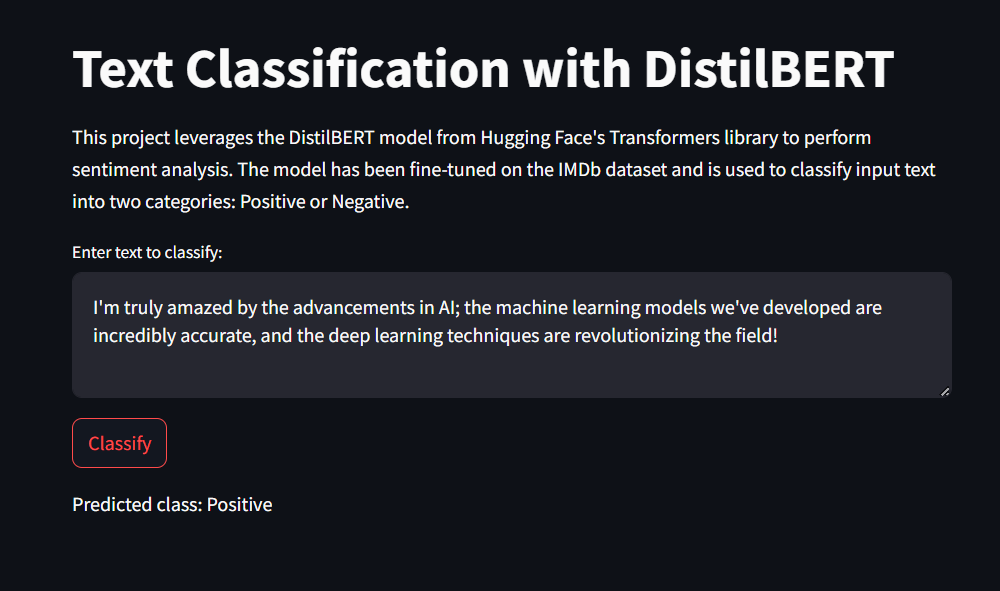

# Text Classification with Fine-Tuned DistilBERT



This project leverages the DistilBERT model from Hugging Face's Transformers library to perform sentiment analysis. The model has been fine-tuned on the IMDb dataset and is used to classify input text into two categories: **Positive** or **Negative**.

## Features

- **User Input:** Users can input any text into the application.
- **Sentiment Classification:** The app will classify the input text as either "Positive" or "Negative" using the fine-tuned DistilBERT model.
- **Streamlit Integration:** The application is made using Streamlit, providing an interactive web-based interface.

## Installation

### Prerequisites

- Python 3.11 or higher
- Conda or pip for package management

### Setting Up the Environment

1. Create a new Conda environment:

```bash
conda create --name text_classification python=3.11

conda activate text_classification
```

2. Install Pytorch:

#### Using `conda`

#### MacOS

```bash
conda install pytorch==2.3.1 torchvision==0.18.1 torchaudio==2.3.1 -c pytorch
```
#### Windows and Linux
   
CUDA 11.8

```bash
conda install pytorch==2.3.1 torchvision==0.18.1 torchaudio==2.3.1 pytorch-cuda=11.8 -c pytorch -c nvidia
```
CUDA 12.1

```bash
conda install pytorch==2.3.1 torchvision==0.18.1 torchaudio==2.3.1 pytorch-cuda=12.1 -c pytorch -c nvidia
```
CPU Only

```bash
conda install pytorch==2.3.1 torchvision==0.18.1 torchaudio==2.3.1 cpuonly -c pytorch
   ```

#### Using `pip`

#### MacOS

   ```bash
  pip install torch==2.3.1 torchvision==0.18.1 torchaudio==2.3.1
   ```
#### Windows and Linux 

(ROCM 6.0, Linux only)

```bash
pip install torch==2.3.1 torchvision==0.18.1 torchaudio==2.3.1 --index-url https://download.pytorch.org/whl/rocm6.0
```
CUDA 11.8

```bash
pip install torch==2.3.1 torchvision==0.18.1 torchaudio==2.3.1 --index-url https://download.pytorch.org/whl/cu118
```
CUDA 12.1

```bash
pip install torch==2.3.1 torchvision==0.18.1 torchaudio==2.3.1 --index-url https://download.pytorch.org/whl/cu121
```
CPU only

```bash
pip install torch==2.3.1 torchvision==0.18.1 torchaudio==2.3.1 --index-url https://download.pytorch.org/whl/cpu
   ```

3. Install `requirements.txt`

```bash
pip install -r requirements.txt
```


4. Run the Streamlit application:

```bash
streamlit run app\main.py
```
5. Open your web browser and navigate to `http://localhost:8501` to use the application.
